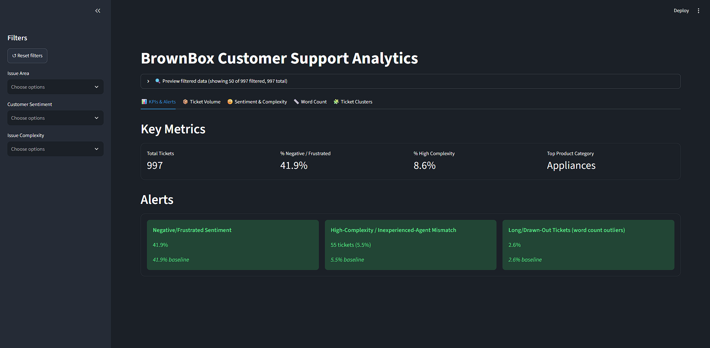
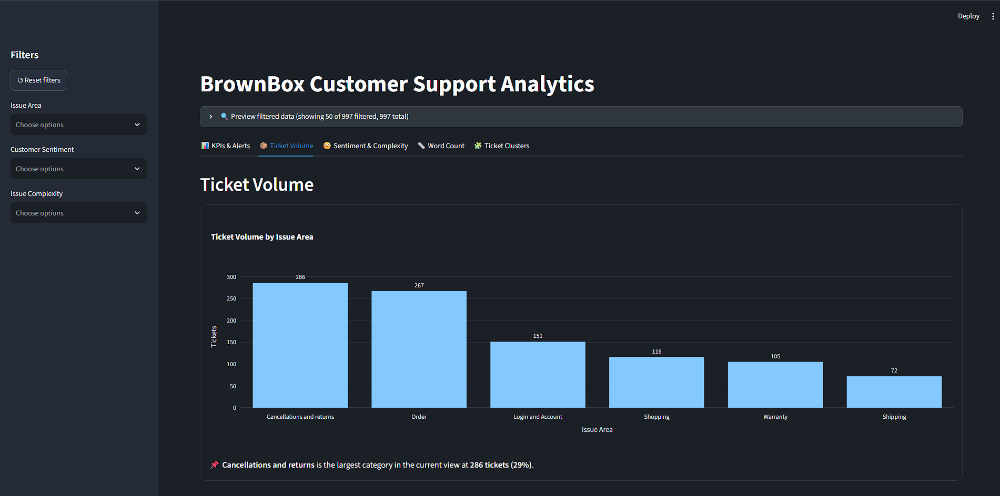
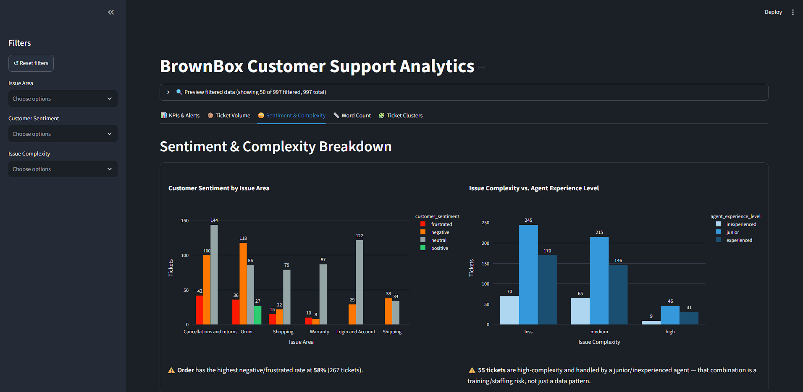
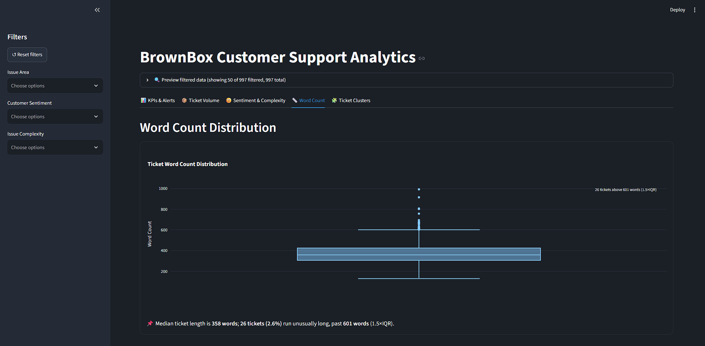
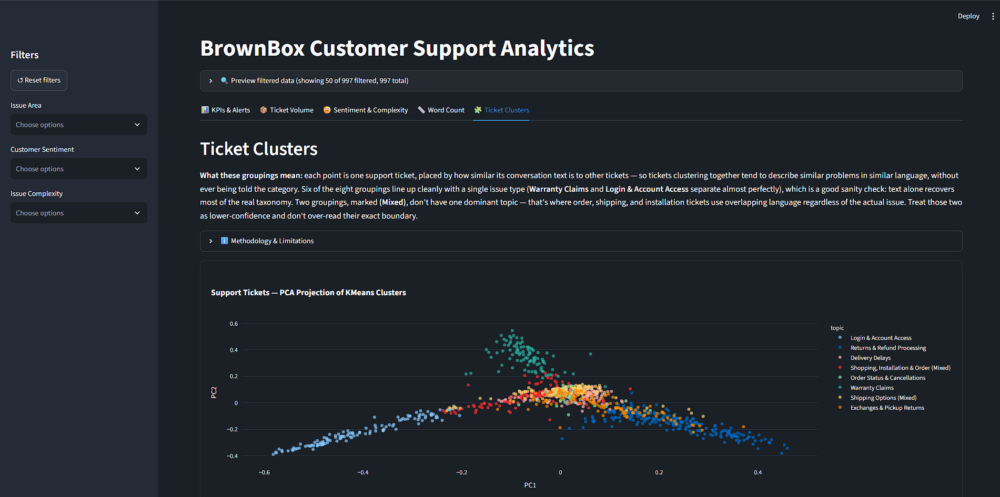

# BrownBox Customer Support Analytics

Month 1 Data Science internship assessment: an NLP classification notebook and an interactive Streamlit BI dashboard, both built on the [NebulaByte E-Commerce Customer Support Conversations](https://huggingface.co/datasets/NebulaByte/E-Commerce_Customer_Support_Conversations) dataset (997 usable tickets after cleaning, fictional company "BrownBox").

## What's in this repo

| Deliverable                   | Location                                    | Points |
| ----------------------------- | ------------------------------------------- | ------ |
| NLP classification notebook   | `notebook/support_nlp_classification.ipynb` | 10     |
| Streamlit analytics dashboard | `dashboard/app.py`                          | 20     |

## Setup

1. Clone the repo and `cd` into it.
2. Create a virtual environment and activate it:
   ```
   python -m venv venv
   source venv/bin/activate        # Windows: venv\Scripts\activate
   ```
3. Install dependencies:
   ```
   pip install -r requirements.txt
   ```

## Running the notebook

```
jupyter notebook notebook/support_nlp_classification.ipynb
```

Loads the dataset via Hugging Face `datasets`, cleans it, vectorizes with TF-IDF, and trains/compares three classifiers (Naive Bayes, Logistic Regression, Linear SVM).

## Running the dashboard

From the **repo root**:

```
streamlit run dashboard/app.py
```

The dashboard is organized into five tabs — KPIs & Alerts, Ticket Volume, Sentiment & Complexity, Word Count, and Ticket Clusters — reflecting the same narrative order used in the oral walkthrough.

The dashboard reads a pre-processed parquet file (`data/conversations_preprocessed.parquet`) produced by the notebook's cleaning steps. Run the notebook at least once first if that file isn't already present. The data path in `dashboard/utils/data_loader.py` is anchored to the file's own location, so this works whether you launch Streamlit from the repo root or from inside `dashboard/`.

## Repo structure

```
data-science-internship-month1/
├── README.md
├── requirements.txt
├── data/
│   └── conversations_preprocessed.parquet
├── notebook/
│   └── support_nlp_classification.ipynb
├── dashboard/
│   ├── app.py
│   └── utils/
│       ├── data_loader.py       # parquet loading, cached
│       ├── clustering.py        # TF-IDF vectorization, KMeans, PCA
│       ├── explore_clustering.py# elbow/silhouette exploration, top terms per cluster
│       ├── kpis.py              # KPI card calculations
│       ├── charts.py            # volume / sentiment / complexity / distribution charts
│       └── alerts.py            # dynamic alert thresholds vs. baseline
```

## Key findings

**Notebook — classification**

- Linear SVM was the best-performing model of the three tested: **94.5% test accuracy, 0.947 macro-F1**.
- Macro-F1 was prioritized over plain accuracy or weighted-F1 due to ~4x class imbalance across issue categories.
- Predictive feature analysis (LinearSVC coefficients) surfaces the vocabulary each class relies on most, discussed in the notebook's feature analysis section.

**Dashboard — support ticket patterns**

- Ticket volume, sentiment, and complexity are explorable live via sidebar filters (issue area, sentiment, complexity), with a one-click reset.
- Sentiment and complexity are tracked as separate KPIs deliberately — one measures how the customer feels, the other measures how hard the ticket is to resolve; they don't move together.
- A recurring risk pattern: high-complexity tickets landing with junior/inexperienced agents. This is surfaced both as a chart annotation and as a dynamic alert.
- Unsupervised KMeans (k=8) over TF-IDF, visualized via PCA, cleanly separates topics like Login & Account Access, Warranty Claims, and Returns & Refund Processing. Order/Shipping/Installation topics overlap more (see Known Limitations).

## Known limitations

- **No timestamp column in the source dataset** — time-trend / response-time charts were scoped out for this reason (confirmed against the dataset's actual columns), not from lack of effort.
- **Silhouette scores are low** — 0.027–0.048 across k=2–10 tested, consistent with TF-IDF conversation text not separating into tight, well-defined clusters at this dataset size. k=6 was tried first as a domain-informed default (issue_area has 6 real categories); two preprocessing fixes — capping terms appearing in over 60% of tickets, and removing agent first names plus boilerplate phrases (thank you, please, sure) that were leaking into top per-cluster terms — improved results over a plain baseline (silhouette 0.043→0.051, ARI 0.349→0.372, NMI 0.479→0.509 at k=6). Both fixes were validated against real issue_area labels (ARI/NMI), not silhouette alone.
- **k=8 was adopted over k=6** for a higher ARI (0.405 vs. 0.372) and because it split a broad "Returns & Refunds" bucket into two genuinely distinct, interpretable sub-themes — exchanges/pickup returns vs. refund/bank processing — rather than fragmenting arbitrarily. Silhouette was actually slightly _lower_ at k=8 (0.049) than k=6 (0.051), so it wasn't the deciding factor.
- **Cluster purity varies significantly**, per the cluster-vs-`issue_area` crosstab: six of eight clusters align cleanly with one dominant category — Warranty Claims and Login & Account Access separate especially well (~98% each). Two clusters, covering Shopping/Order/Installation and Shipping Options, have no single dominant category and are labeled "(Mixed)" rather than assigned a false single-topic name — treat those two groupings as lower-confidence.
- **A TruncatedSVD dimensionality-reduction step was tested and rejected**: it raised silhouette further (0.055) but substantially hurt agreement with issue_area (ARI 0.198, NMI 0.344) and collapsed roughly half the dataset into one incoherent cluster — concrete proof that silhouette alone can mislead, which is why it isn't trusted in isolation anywhere in this pipeline.
- **Two different outlier definitions coexist by design**, not by oversight: the word-count box plot recomputes its IQR bounds live off whichever slice is currently filtered (so the plot's outlier count is always relative to what's on screen), while the Alerts section fixes its IQR bounds from the full, unfiltered dataset (so alert severity means "unusual vs. the whole dataset," not "unusual vs. whatever you just filtered to"). Both are intentional; each answers a different question.

## Rubric coverage (dashboard)

| Row                        | Status         |
| -------------------------- | -------------- |
| Clustering & Modes         | ✅             |
| KPI Prioritization         | ✅             |
| Chart Selection & Grouping | ✅             |
| Distribution & Outliers    | ✅             |
| Anomaly/Alert Highlighting | ✅             |
| UI Design & Interactivity  | ✅             |
| Repo & README              | ✅             |
| Oral Walkthrough           | delivered live |

## Screenshots






